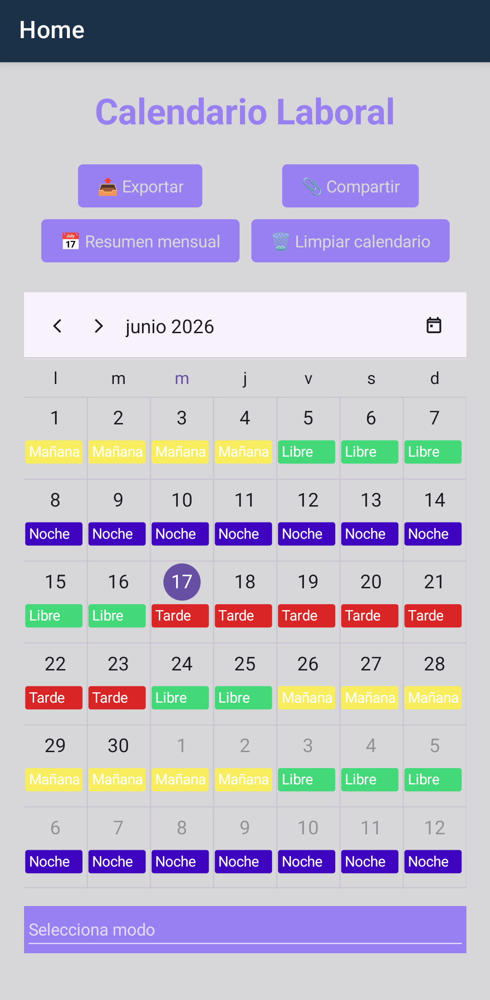
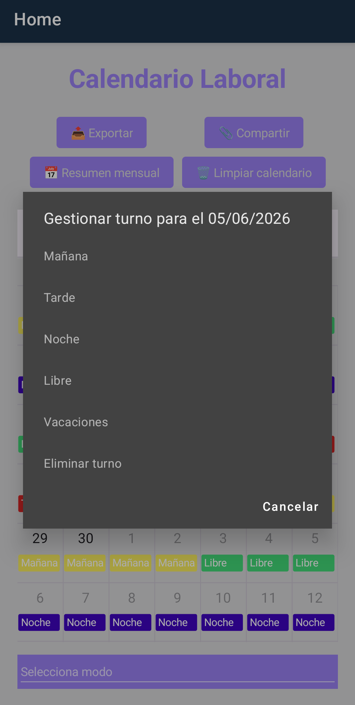
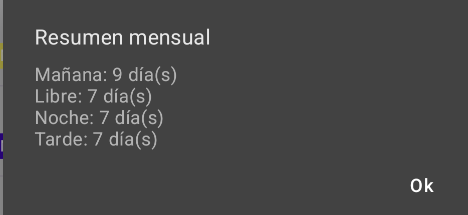

# 📅 Calendario Laboral - Gestión de Turnos de Trabajo


Aplicación móvil y de escritorio desarrollada con **.NET MAUI** para gestionar turnos de trabajo de forma visual e intuitiva. Permite registrar turnos manualmente día a día o generarlos automáticamente aplicando patrones de trabajo habituales como el **Turno Inglés** o el ciclo **5/2**, con persistencia local, resumen mensual y exportación a CSV.

---

## 🚀 Descripción del Proyecto

Calendario Laboral es una app de single-page diseñada para trabajadores a turnos que necesitan visualizar y planificar su calendario laboral de un vistazo. El usuario puede asignar turnos (Mañana, Tarde, Noche, Libre, Vacaciones) tocando directamente sobre los días del calendario, o dejar que la app genere automáticamente un año completo de turnos a partir de una fecha de inicio y el patrón que corresponda a su convenio.

- **Modo Manual:** Toca cualquier día del calendario para asignarle un turno o eliminarlo. Los turnos se guardan automáticamente en el dispositivo en formato JSON.
- **Modo Automático:** Selecciona un patrón de rotación y una fecha de inicio; la app genera y colorea 365 días de turnos sin intervención del usuario.
- **Exportación y Compartición:** Los turnos pueden exportarse a un archivo CSV y compartirse directamente desde la app con cualquier otra aplicación del dispositivo.

---

## ✨ Funcionalidades Clave

✅ **Calendario Visual Interactivo:** Componente `SfScheduler` de Syncfusion en vista mensual con código de colores por tipo de turno (azul oscuro → Mañana, lila → Tarde, rojo → Noche, verde → Libre, rosa → Vacaciones).  
✅ **Gestión Manual de Turnos:** Toca cualquier día para asignar, modificar o eliminar un turno mediante un menú contextual emergente.  
✅ **Generación Automática de Patrones:** Dos patrones predefinidos: Turno Inglés (ciclo de 28 días: 7N-2L-7T-2L-7M-3L) y ciclo 5/2 con rotación de mañana, tarde y noche.  
✅ **Persistencia Local:** Los turnos se serializan en JSON y se guardan en el directorio de datos de la app, recuperándose automáticamente al relanzarla.  
✅ **Resumen Mensual:** Conteo agrupado por tipo de turno del mes en curso, mostrado en un alert con un solo toque.  
✅ **Exportar y Compartir:** Genera un CSV ordenado por fecha (`Fecha,Turno`) y lo comparte con el sistema nativo de compartición del dispositivo.  
✅ **Multiplataforma:** Un único proyecto corre en Android, iOS, macOS (Mac Catalyst) y Windows gracias a .NET MAUI.

---

## 📸 Galería

### 📅 Vista Mensual
Calendario con código de colores por tipo de turno: Mañana, Tarde, Noche, Libre y Vacaciones.


### ✏️ Asignación de Turno
Menú contextual emergente al tocar un día para asignar o modificar el turno.


### 📋 Resumen Mensual
Conteo agrupado por tipo de turno del mes en curso.


---

## 🎨 Código de Colores

| Turno       | Color       | Hex       |
|-------------|-------------|-----------|
| 🟣 Mañana   | Azul oscuro | `#3F04BF` |
| 🔵 Tarde    | Lila        | `#9980F2` |
| 🔴 Noche    | Rojo        | `#D92525` |
| 🟢 Libre    | Verde       | `#43D978` |
| 🩷 Vacaciones | Rosa      | `#F7B6F6` |

---

## 📂 Estructura del Proyecto

```text
├── AppCalendarioLaboral/
│   ├── MainPage.xaml          # 🎨 Interfaz principal (calendario + botones de acción)
│   ├── MainPage.xaml.cs       # 🧠 Lógica de turnos, patrones y persistencia
│   ├── App.xaml / App.xaml.cs # Configuración de la aplicación
│   ├── AppShell.xaml          # Shell de navegación
│   ├── MauiProgram.cs         # Punto de entrada y registro de servicios
│   └── Platforms/             # Configuración específica por plataforma
│       ├── Android/           # AndroidManifest, MainActivity
│       ├── iOS/               # AppDelegate, Info.plist
│       ├── MacCatalyst/       # AppDelegate, Entitlements
│       └── Windows/           # App.xaml de Windows
├── AppCalendarioLaboral.sln   # Solución de Visual Studio
└── .gitignore
```

---

## ⚙️ Requisitos e Instalación

### Requisitos previos

- [Visual Studio 2022](https://visualstudio.microsoft.com/) con la carga de trabajo **.NET MAUI** instalada
- .NET 8 SDK
- Licencia de Syncfusion (gratuita para uso comunitario en [syncfusion.com](https://www.syncfusion.com/products/communitylicense))

### Pasos

1. Clona el repositorio y abre `AppCalendarioLaboral.sln` en Visual Studio.
2. Registra tu clave de licencia de Syncfusion en `MauiProgram.cs`:
   ```csharp
   Syncfusion.Licensing.SyncfusionLicenseProvider.RegisterLicense("TU_CLAVE");
   ```
3. Selecciona la plataforma destino (Android, iOS, Windows) y pulsa **Ejecutar**.

### Dependencias NuGet

```
Syncfusion.Maui.Core      v24.1.41
Syncfusion.Maui.Calendar  v24.1.41
Syncfusion.Maui.Scheduler v24.1.41
Microsoft.Maui.Controls   v8.0.5
```

---

## 📓 Notas de Desarrollo

La app demuestra el uso de .NET MAUI como framework de UI multiplataforma a partir de un único proyecto C#. La clave del diseño es la separación entre la lógica de patrones de turnos (definidos como arrays de enumerados cíclicos) y el componente visual `SfScheduler`, que actúa como vista reactiva sobre una `ObservableCollection`. La persistencia se resuelve con serialización JSON nativa de .NET, sin dependencias de base de datos externas.

**build:** versión 1.0.0 estable
